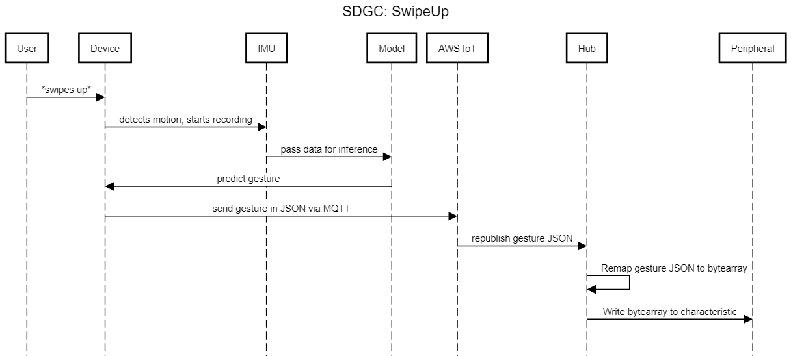
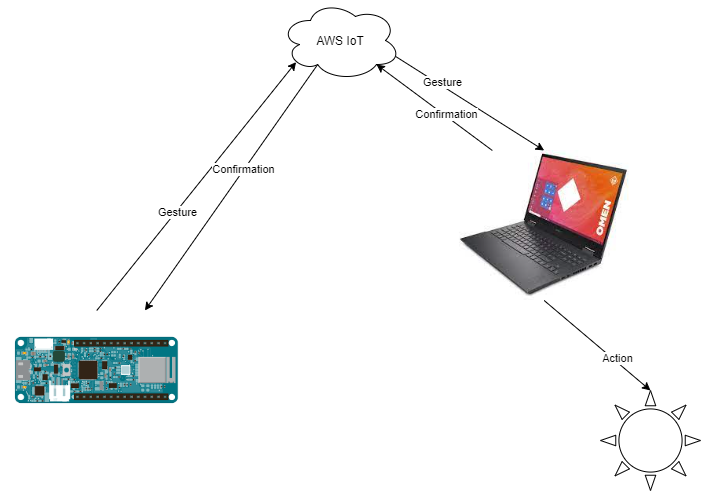
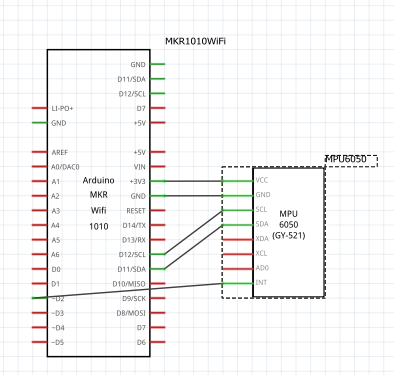

# Introduction

This is my final project for CSS-532 (Internet of Things) at UWB. It is a gesture control device that interfaces with other appliances via BLE, and also uses the AWS IoT Cloud as backend for some other routing and processing. The device I am using is an Arduino MKR 1010 WiFi, which supports both WiFi and BLE; while the original plan was to have the device handle all WiFi and BLE by itself, unfortunately I later came to realize that this board cannot handle both features _simultaneously_. Thus, the workaround was to create a Python Hub app that was also registered to AWS IoT as a Thing, listen for MQTT messages from the broker that were being sent by the Arduino, and then translate the message into a bytearray that would eventually be sent to the peripheral.  
The gesture data was recorded by using an MPU6050, and utilizing its DMP for ease of accurate readings on real acceleration [x, y, z] and rotation (as a quaternion [w, x, y, z]).  
This particular repository is merely a proof-of-concept, and therefore is extremely limited in its capability - like, all it is programmed to do is turn another Arduino's (Arduino Nano 33 BLE Sense) LED on/off.\
The following sequence diagram illustrates a sample usecase of this project.

[Here is a video that demonstrates the full project in action.](https://drive.google.com/file/d/1FRbBJqgvwo-OsWDxSmSbhf1nBRPFdGwT/view?usp=sharing)  
[Another video, with the lights off.](https://drive.google.com/file/d/1t5s9y2KN-kz2gy2Bqp8x6UXWdlEbkmz9/view?usp=sharing)  
Here is a different diagram of how the pieces interact with each other at a higher level:
  
Here is a circuit diagram of the wearable device:  

# Repository Structure
If for some reason you're interested on trying to run all of this yourself, here is a brief rundown of what you'll need to keep track of; some things were included in the .gitignore to save space that will be crucial to running the program.  
This project was developed using the PlatformIO IDE extension in VSCode; I would recommend you download it and open this repository in the IDE as well so that you can use the configuration files to automatically handle the toolchain needed to build and upload the code to the microcontroller.

## `./Hub/`
You'll need to register an AWS IoT thing, get the RootCA, private key, and certificate and put it in   `./Hub/certs/`. You'll also need to modify the `./Hub/awsiothub.py` code a little to change the respective certificate directory strings at the top of the script. `awsiothub.py` also depends on `Bleak` for BLE services and the `AWS IoT Device SDK` for the connection to AWS IoT Core; both should be available via `pip`.

## `./Lib/`
Only one dependency was unable to be resolved by PlatformIO's library repository, and that was Jeff Rowberg's I2C/MPU6050 library; I pulled this from its github repo and placed the respective folders from the repo into my `./Lib/` folder. Thus, ultimately the required folder structure should look something like this:  
|--lib  
|  |--I2CDEV  
|  |--MPU6050  

## `./Model/`
This folder contains the SVM training `.ipynb` files as well as the `.csv` training data; the data was recorded using [SerialPlot](https://hackaday.io/project/5334-serialplot-realtime-plotting-software), and contains around 15 samples, per train/set, and per gesture. Each gesture was recorded as a fixed sequence of ten samples over a second (so there was a 100 ms delay between each sample); with sample being a 7-dimensional vector [acc.x, acc.y, acc.z, qua.w, qua.x, qua.y, qua.z], we flatten the time-series so that it turns into a 70-dimensional vector for the SVM to read.  
You don't really need to touch this folder, but if you somehow want to retrain the model on your own data, then you need to write code for your IMU to output to SerialPlot, put the respective `.csv` files into the `./Model/data/` folder, and run the notebook. Or better yet, try to use TF-Lite!  
At the time of writing, the model that is loaded as a source file onto the microcontroller is an SVM with a linear kernel, has ~80% accuracy, and takes up about 20KB of memory.

# Dependencies 

## Hardware 

### SAGC Device:
- Arduino MKR 1010 WiFi
- MPU6050

### Hub:
- I just used my laptop, that had BLE capabilties 

### Peripheral:
- Arduino Nano 33 BLE Sense 
- Or just any Arduino that can run the `ArduinoBLE/Blink` sample sketch

## Software 

### SAGC Device:
- Developed on `PlatformIO`
- Lib Dependencies:
  - `ArduinoBLE`
  - `WiFiNINA`
  - `ArduinoMqttClient`
  - `ArduinoBearSSL`
  - `ArduinoECCX08`
  - `ArduinoJson`
  - `I2CDEV, MPU6050` - not included in `PlatformIO` lib repo

### Hub:
- Python 3.X (I think 3.4 and above ? I used 3.9.X)
- Dependencies:
  - `Bleak` (BLE)
  - `AWS IoT Device SDK` (AWS IoT Core, MQTT)

### Peripheral:
- Pretty sure all you need is `ArduinoBLE`